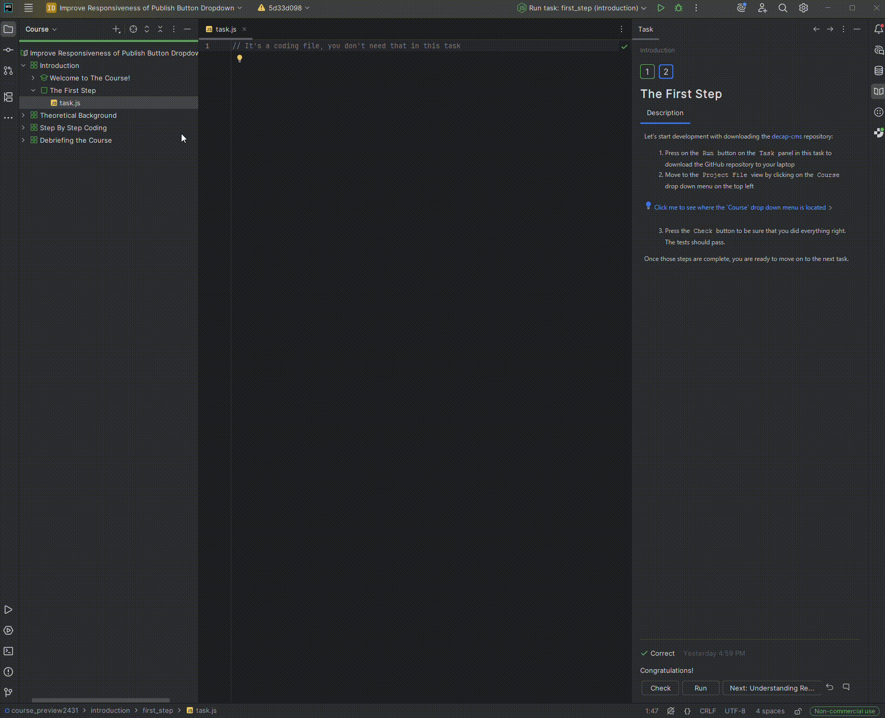

Let's start development with downloading the [decap-cms](https://github.com/decaporg/decap-cms) repository:

1) Wait for the `npm install` and the file indexing to be done. Once they are finished, press on the `Run` button on the `Task`
panel in this task to download the GitHub repository to your laptop
   2) Move to the `Project File` view by clicking on the
      `Course` drop down menu on the top left

3) Wait until the IDE finished to index the new files. Then press the `Check` button to be sure that you did everything right. 
The tests should pass.

Once those steps are complete, you are ready to move on to the next task.